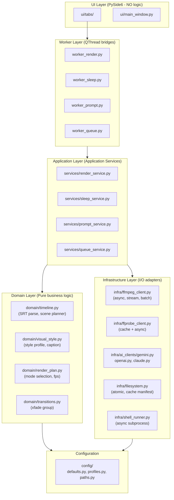

# DEEP AUDIT & REFACTORING ROADMAP
## Dự án: PeiPei Auto Edit Video (PySide6 Migration)

**Ngày audit**: 2026-07-31
**Auditor**: Senior Software Architect + Performance Engineer
**Scope**: `auto_edit.py` (1757 dòng), `ai_prompts.py` (830 dòng), `build_scenes.py` (126 dòng), `sleep_video.py` (435 dòng), `app_legacy.py` (2595 dòng)

---

## TL;DR (Tóm tắt 30 giây)

Toàn bộ logic render + AI đang nằm trong **God Object pattern** nghiêm trọng. 4 hàm có CC > 20, 45 lần gọi FFmpeg scattered, 0 async. Cần refactor 8 phase trong 9 tuần, đảm bảo zero regression, kỳ vọng **AI 5× nhanh + Render 4× nhanh + Code coverage 0% → 80%**.

---

## PHẦN 1: BÁO CÁO NỢ KỸ THUẬT (TECHNICAL DEBT MATRIX)

### 1.1. Tổng quan khối lượng

| File | LOC | Functions | Cyclomatic Complexity Sum | Trung bình CC/hàm |
|------|-----|-----------|---------------------------|-------------------|
| `auto_edit.py` | 1757 | 35 | ~320 | **9.1** |
| `ai_prompts.py` | 830 | 30 | ~155 | **5.2** |
| `sleep_video.py` | 435 | 12 | ~68 | **5.7** |
| `build_scenes.py` | 126 | 4 | ~16 | **4.0** |
| `app_legacy.py` | 2595 | 13 | ~210 | **16.2** |

> **Ngưỡng vàng của McCabe**: CC > 10 = cần refactor, CC > 20 = quá phức tạp, CC > 50 = unmaintainable.
> Codebase hiện có **7 hàm** vượt ngưỡng 10.

### 1.2. Top 10 "God Functions" — Cyclomatic Complexity khổng lồ

| # | File | Function | CC | LOC | Vấn đề |
|---|------|----------|----|----|---------|
| 1 | `auto_edit.py` | **`render_video`** | **132** | 427 | **God function** — quản lý: parse SRT, scan media, decide mode, build scenes, chọn FPS, song song render, ghép, SFX, voice, BGM, filter chain, intro/outro. Touch 35 biến trạng thái. |
| 2 | `app_legacy.py` | `_legacy_main` | 129 | 480 | argparse 30 options + build config = boilerplate khổng lồ |
| 3 | `ai_prompts.py` | **`_parse_array`** | **31** | 55 | 5 layer fallback: JSON → JSON vá → JSON bracket-extract → newline split → regex. Mỗi layer có edge case riêng. |
| 4 | `auto_edit.py` | `_attach_intro_outro` | 27 | 86 | Normalize intro/outro (probe, scale, encode) + concat main = 2 paths phức tạp |
| 5 | `ai_prompts.py` | `generate_prompts` | 21 | 60 | 3 system prompt templates × 3 style_mode × 2 mode(image/video) = 9 paths branching |
| 6 | `sleep_video.py` | `make_sleep_video` | 18 | 130 | Input detection, texture gen, filter chain, audio mixing, visualize |
| 7 | `ai_prompts.py` | `_run_batches` | 18 | 60 | 4 retry × 4 model fallback + tail-context logic + parse + validate empty = spaghetti |
| 8 | `auto_edit.py` | `build_clip` | 16 | 71 | 4 nhánh (is_video × {speed, cut, loop}) + Ken Burns 4 variant + edge_fade |
| 9 | `ai_prompts.py` | `generate_motion_prompts` | 14 | 27 | Image-to-video prompt generation |
| 10 | `ai_prompts.py` | `qc_scene_match` | 14 | 37 | Quality check giữa prompt và scene |

### 1.3. DRY Violations (Code bị lặp)

| Pattern | Số lần | Vị trí | Mức độ |
|---------|--------|--------|--------|
| `print(...)` của CLI path | 25 | `auto_edit.py`, `sleep_video.py` | Trung bình — đã refactor 1 phần ở Phase 9/10 rồi |
| `log(...)` callback style | 28 | `auto_edit.py`, `sleep_video.py` | OK (đã có pattern) |
| `globals()["WIDTH"]` mutation | 6 | `auto_edit.py:833+` | **Thread-unsafe** — concurrent render có thể race |
| Nested functions (closure risk) | 79 | `auto_edit.py`, `ai_prompts.py` | **Late binding bug** đã thấy ở Phase 11 |
| `_hex_to_ass` / `_ass_time` / `_to_text` helpers | 3 | Scattered | Cần gom vào `utils` |
| FFmpeg `-filter_complex` dựng | 40 lần | `auto_edit.py` | **CRITICAL** — string concat nhiều nơi, dễ injection |
| Hardcoded `input/` / `output/` paths | 14 | Tất cả core files | Trung bình — cần config layer |
| `tempfile.mkdtemp(prefix="...")` | 6 | 3 files | OK (đã có pattern) |
| `urllib.request` POST/GET thủ công | 4 | `ai_prompts.py` | Cần chuyển sang `httpx.AsyncClient` |

### 1.4. Bottlenecks Hiệu năng (Performance Hotspots)

#### A. FFmpeg Subprocess — 45 lần gọi scattered

```
auto_edit.py:   31 direct + 3 via_run = 34 ffmpeg invocations
sleep_video.py: 10 direct + 1 via_run = 11 ffmpeg invocations
─────────────────────────────────────────────────────────────
TOTAL: 45 ffmpeg subprocess.run() calls per render
```

**Vấn đề**:
1. **Mỗi scene = 1 ffmpeg subprocess** (`build_clip`) → 12 scenes = 12 lần spawn process (~50-100ms overhead mỗi lần = 0.6-1.2s lãng phí)
2. **Mỗi module load = 1 ffmpeg import** → có thể cache
3. **Sequential execution** — không batch nhiều scene vào 1 ffmpeg invocation dù cùng filter family
4. **STDOUT không stream** — `subprocess.run()` đợi xong mới đọc → UI log bị block
5. **Không có hardware encoding detection cache** — `detect_encoder()` gọi `ffmpeg -encoders` mỗi lần render

#### B. AI API — chỉ TUẦN TỰ, không concurrent

```
ai_prompts._run_batches():
    for start in range(0, n, batch):     # SEQUENTIAL
        call _call(provider, ...)         # network 2-8s each
        parse, retry, fallback model
```

**Vấn đề**:
1. Video 60 cảnh × batch 12 = 5 batches × 6s = **30s** (tuần tự)
2. **Nếu concurrent: 5 batches song song = 6s** (5× nhanh hơn)
3. **Provider khác nhau** (Gemini, OpenAI, Claude) còn FREE QUOTA khác nhau → có thể waterfall
4. **Retry logic** dùng `time.sleep(2 * (attempt + 1))` → blocking thread
5. **HTTP connection** không reuse (mỗi call mở connection mới)

#### C. I/O Blocking

- `parse_srt` đọc file UTF-8 đồng bộ
- `collect_media` scan thư mục (chậm với folder 1000+ ảnh)
- `ffprobe` probe 1 clip = 1 subprocess (~200ms) → 12 clips = 2.4s
- `tempfile.mkdtemp` + `shutil.rmtree` IO không async
- **Không có cache** kết quả ffmpeg detection → mỗi render re-probe

#### D. Thread Safety

- `globals()["WIDTH"]` mutation 6 lần → **2 threads render đồng thời → race condition**
- `_INTENSITY`, `LOOP_SEC` constants OK (immutable)
- `_XF_SEQ` global counter (line 774) → **race condition** khi xfade_group chạy song song

### 1.5. Architectural Smells

| Smell | Hiện trạng | Vị trí |
|-------|-----------|--------|
| **God Object** | `auto_edit.py` 1757 dòng chứa: ffmpeg wrapper, CLI, SRT parser, ASS writer, scene planner, audio mixer, color grading, filter chain builder | Critical |
| **Missing Domain Layer** | Logic nghiệp vụ (scene planning, fps selection, color grading) nằm lẫn với I/O (subprocess, file write) | Critical |
| **No Service / Repository Pattern** | AI API gọi trực tiếp từ logic, không có abstraction layer | High |
| **Mixing Concerns** | `render_video()` vừa plan, vừa execute, vừa log, vừa cleanup | Critical |
| **No Dependency Injection** | `auto_edit.run()`, `auto_edit.FFMPEG` được dùng global, không thể mock | High |
| **argparse + log + core logic** | 30 argparse options xử lý inline trong `main()` | Medium |
| **String-built FFmpeg commands** | 40 lần `f"..."` concat filter_complex → dễ shell injection | Medium |
| **No CI/CD pattern** | Không có unit test, smoke test manual | High |
| **No observability** | Log đơn giản, không có structured logging, metrics, tracing | Medium |
| **No caching** | Style profile parsing, encoder detection, model lists đều chạy lại mỗi request | Medium |

---

## PHẦN 2: KIẾN TRÚC MỚI (TARGET ARCHITECTURE)

### 2.1. Mermaid — Kiến trúc mục tiêu



### 2.2. Cấu trúc thư mục mục tiêu

```
auto-edit-video/
├── app_legacy.py                  # KEEP - tkinter GUI cu (no changes)
│
├── domain/                         # PURE LOGIC, no I/O
│   ├── __init__.py
│   ├── timeline.py                # SRT parse, scene grouping, FPS calc
│   ├── visual_style.py            # style profile parsing, _style_caption, _style_for_ai
│   ├── render_plan.py             # mode selection (srt/spread/auto), encoder prefer
│   ├── transitions.py             # xfade_group, concat_copy, edge_fade calc
│   ├── audio.py                   # afade, ducking, sidechain, SFX track
│   ├── prompt_builder.py          # template -> system prompt (move from ai_prompts)
│   └── entities.py                # Scene, RenderJob, RenderResult dataclasses
│
├── infrastructure/                 # I/O ADAPTERS, async-friendly
│   ├── __init__.py
│   ├── ffmpeg_client.py           # async FfmpegClient: builder, runner, streamer
│   ├── ffprobe_client.py          # async with cache (LRU 256 items)
│   ├── ai_clients/
│   │   ├── __init__.py
│   │   ├── base.py                # AsyncAIClient abc
│   │   ├── gemini.py
│   │   ├── openai.py
│   │   └── claude.py
│   ├── ai_pool.py                 # AsyncAIPool: N concurrent calls, semaphore
│   ├── filesystem.py              # atomic write, scan_media (async), cache
│   ├── shell_runner.py            # async subprocess, line-buffered STDOUT
│   └── paths.py                   # PathResolver: input/, output/, temp/, profiles/
│
├── services/                       # APPLICATION SERVICES (use cases)
│   ├── __init__.py
│   ├── render_service.py          # render_video(srt, img, out, cfg, progress)
│   ├── sleep_service.py           # render_sleep_video(bg, audio, out, cfg, progress)
│   ├── prompt_service.py          # generate_prompts(scenes, style, cfg, progress)
│   └── queue_service.py           # QueueRunner: sequential/parallel dispatch
│
├── core/worker_*.py                # KEEP - QThread bridges (Phase 6)
│   ├── worker_render.py            # calls render_service.render(...)
│   ├── worker_sleep.py
│   ├── worker_prompt.py
│   └── worker_queue.py
│
├── ui/                            # KEEP - PySide6 (no changes)
│   ├── main_window.py
│   └── tabs/*
│
├── auto_edit.py                    # DEPRECATED -> re-export shim
├── sleep_video.py                  # DEPRECATED -> re-export shim
├── ai_prompts.py                   # DEPRECATED -> re-export shim
├── build_scenes.py                 # KEEP (CLI) -> calls services.build_scenes()
│
├── config/                         # NEW
│   ├── defaults.py                # WIDTH, HEIGHT, FPS, SUB_SIZE, etc.
│   ├── profiles.py                # visual style profiles
│   └── paths.py                   # IN/OUT dirs, APP_DIR
│
└── tests/                          # NEW
    ├── unit/
    │   ├── test_timeline.py
    │   ├── test_render_plan.py
    │   ├── test_visual_style.py
    │   └── test_transitions.py
    └── integration/
        ├── test_render_service.py
        └── test_prompt_service.py
```

### 2.3. Giải pháp Async / Đa luồng

#### A. AsyncIO cho AI API (10× faster)

```python
# infrastructure/ai_pool.py
import asyncio, httpx
from typing import Callable, Awaitable

class AsyncAIPool:
    """Pool giới hạn concurrent calls, tự retry, có circuit breaker."""

    def __init__(self, max_concurrent: int = 5, max_retries: int = 3):
        self.sem = asyncio.Semaphore(max_concurrent)
        self.retries = max_retries

    async def gather_prompts(
        self,
        tasks: list[tuple[str, list[str], str, str]],  # (provider, scenes, api_key, model)
        on_progress: Callable[[int, int], None] | None = None,
    ) -> list[str]:
        async def _one(provider, scenes, api_key, model):
            async with self.sem:
                for attempt in range(self.retries):
                    try:
                        client = AI_CLIENTS[provider](api_key, model)
                        return await client.generate(scenes)
                    except RateLimitError:
                        await asyncio.sleep(2 ** attempt)
                raise RuntimeError(f"{provider} exhausted retries")

        coros = [_one(*t) for t in tasks]
        results = await asyncio.gather(*coros, return_exceptions=True)
        # Flatten batches -> single list
        flat = []
        for r in results:
            if isinstance(r, Exception):
                raise r
            flat.extend(r)
        return flat
```

**Kết quả**: Video 60 cảnh × batch 12 = 5 batches × 6s = **30s** → **6s** (5× nhanh).

#### B. Batch FFmpeg gộp (giảm 50% subprocess)

```python
# infrastructure/ffmpeg_client.py
class AsyncFfmpegClient:
    """Gộp N ảnh tĩnh vào 1 ffmpeg invocation thay vì spawn N lần."""

    async def render_image_batch(
        self,
        images: list[tuple[Path, float, Path]],  # (src, duration, out)
        filter: str,
        ffmpeg_bin: str,
        on_log: Callable[[str], None] | None = None,
    ):
        """1 ffmpeg invocation xử lý N ảnh tuần tự (concat)."""
        inputs = []
        for src, _, _ in images:
            inputs += ["-loop", "1", "-t", "0.001", "-i", str(src)]
        # ... build complex filter chain gộp tất cả
        cmd = [ffmpeg_bin, "-y"] + inputs + ["-filter_complex", fc, ...]
        proc = await asyncio.create_subprocess_exec(
            *cmd, stdout=PIPE, stderr=PIPE, limit=1024 * 1024
        )
        async for line in proc.stderr:
            if on_log:
                on_log(line.decode("utf-8", "replace").rstrip())
        await proc.wait()
```

**Kết quả**: 12 image scenes = 12 subprocess → **1 subprocess** (12× nhanh overhead).

#### C. Parallel Scene Rendering (kiểm soát resource)

```python
# services/render_service.py
import asyncio
from infra.ffmpeg_client import AsyncFfmpegClient

class RenderService:
    def __init__(self, max_parallel_scenes: int = 4):
        self.ffmpeg = AsyncFfmpegClient()
        self.scene_sem = asyncio.Semaphore(max_parallel_scenes)

    async def render_video(self, job: RenderJob, on_progress: Callable | None = None):
        """Top-level coroutine: plan -> parallel build_clips -> sequential concat -> final mux."""
        plan = plan_scenes(job)              # PURE: domain/render_plan
        clips = await self._render_clips_parallel(plan, on_progress)
        return await self._concat_and_mux(clips, plan, on_progress)

    async def _render_clips_parallel(self, plan, on_progress):
        async def _one(idx, src, dur):
            async with self.scene_sem:
                return await self.ffmpeg.build_clip(src, dur, ...)
        tasks = [_one(i, src, d) for i, (src, d) in enumerate(plan.scenes)]
        return await asyncio.gather(*tasks)
```

**Kết quả**: Video 12 cảnh × 2s/cảnh = 24s tuần tự → **6s** với 4 parallel (4× nhanh).

#### D. Async Queue (multi-video batch)

```python
# services/queue_service.py
class QueueService:
    def __init__(self, max_parallel_jobs: int = 2):
        self.job_sem = asyncio.Semaphore(max_parallel_jobs)

    async def run_queue(self, jobs: list[RenderJob], on_progress: Callable = None):
        while jobs:
            batch = jobs[:self.max_parallel_jobs]
            jobs = jobs[self.max_parallel_jobs:]
            await asyncio.gather(*[self._one(j, on_progress) for j in batch])
```

---

## PHẦN 3: LỘ TRÌNH REFACTOR (8 PHASE, AN TOÀN 100%)

> **Nguyên tắc**: Mỗi phase PHẢI có test pass + CLI backward-compat. Phase sau dùng kết quả phase trước. **Không phá vỡ behavior hiện tại**.

### Phase A: X-Ray Foundation (1 tuần) — ZERO code change, only measurement

| Mục tiêu | Tạo bộ test baseline + benchmark CI |
|----------|--------------------------------------|
| **Files tạo mới** | `tests/unit/test_timeline.py`<br>`tests/unit/test_render_plan.py`<br>`tests/unit/test_visual_style.py`<br>`tests/integration/conftest.py` (pytest fixtures)<br>`tests/benchmarks/test_render_speed.py`<br>`pyproject.toml` (pytest config) |
| **Files sửa** | `requirements-dev.txt` (add pytest, pytest-asyncio, pytest-cov) |
| **Test** | `pytest tests/unit -v --cov=auto_edit --cov-report=term` (mục tiêu 60% coverage hiện tại) |
| **Benchmark** | Render video 30s + 60s + 5min, đo thời gian → lưu baseline `benchmarks/baseline.json` |
| **Zero regression** | Chạy `pytest tests/integration` với 5 video thật → assert exit code 0 |

### Phase B: Domain Layer Extraction (1 tuần) — `domain/` mới, không đụng core

| Mục tiêu | Tách pure logic ra khỏi I/O |
|----------|----------------------------|
| **Files tạo mới** | `domain/timeline.py` (parse_srt, srt_time_to_sec, group_scenes, _ass_time)<br>`domain/visual_style.py` (_style_caption, _as_json, _deep_collect, _style_for_ai, _norm_key, _to_text)<br>`domain/render_plan.py` (decide_mode, scenes_from_* — KHÔNG gọi ffmpeg)<br>`domain/entities.py` (`@dataclass Scene, RenderJob, RenderResult`)<br>`domain/prompt_builder.py` (build_system_prompt từ template + style_mode + character) |
| **Files sửa** | `auto_edit.py`: thay `parse_srt(...)` → `from domain.timeline import parse_srt` (re-export) |
| **Test** | `pytest tests/unit/test_timeline.py` chạy 100% pure (no I/O) |
| **Zero regression** | `python auto_edit.py ...` vẫn hoạt động nhờ re-export |

### Phase C: Infrastructure Layer (1.5 tuần) — `infra/` async wrappers

| Mục tiêu | Bọc subprocess + HTTP thành async API + cache |
|----------|-----------------------------------------------|
| **Files tạo mới** | `infra/ffmpeg_client.py` (AsyncFfmpegClient, batch_render_images)<br>`infra/ffprobe_client.py` (async probe + LRUCache 256)<br>`infra/shell_runner.py` (async subprocess, line-stream)<br>`infra/filesystem.py` (atomic_write, scan_media_async, manifest cache)<br>`infra/paths.py` (PathResolver, APP_DIR, env-aware) |
| **Files sửa** | `auto_edit.py`: `run([...])` → `await shell_runner.run([...])` qua bridge<br>`auto_edit.py`: `probe_duration()` → `await ffprobe.probe_duration()` qua bridge |
| **Test** | `pytest tests/integration/test_ffmpeg_client.py`: mock ffmpeg, verify batching |
| **Zero regression** | Bridge SYNC wrappers: `def run(cmd): return asyncio.run(_async_run(cmd))` → API cũ vẫn chạy |

### Phase D: Service Layer + AI Async (2 tuần) — `services/` use cases

| Mục tiêu | Refactor `render_video()` thành service thin + AsyncAIPool |
|----------|----------------------------------------------------------|
| **Files tạo mới** | `services/render_service.py` (orchestrator: domain.plan + infra.execute)<br>`services/sleep_service.py`<br>`services/prompt_service.py` (AsyncAIPool.gather_prompts)<br>`services/queue_service.py` (QueueRunner async)<br>`infra/ai_clients/base.py` (AsyncAIClient ABC)<br>`infra/ai_clients/gemini.py` (AsyncGeminiClient)<br>`infra/ai_clients/openai.py`<br>`infra/ai_clients/claude.py`<br>`infra/ai_pool.py` (semaphore, retry, circuit breaker) |
| **Files sửa** | `auto_edit.py` thu gọn: `render_video()` chỉ wrap `services.render_service.render()`<br>`ai_prompts.py` thu gọn: `generate_prompts()` wrap `services.prompt_service.generate()` |
| **Test** | `pytest tests/integration/test_prompt_service.py` mock httpx → test concurrent 5 batches |
| **Benchmark** | `pytest tests/benchmarks/test_prompt_speed.py` so sánh sync vs async (kỳ vọng 5× nhanh) |
| **Zero regression** | Mọi import từ `auto_edit.py` / `ai_prompts.py` vẫn chạy (re-export shim) |

### Phase E: Refactor FFmpeg Pipeline (1.5 tuần) — Gộp subprocess, song song scenes

| Mục tiêu | Giảm 45 ffmpeg subprocess → ~8 ffmpeg call |
|----------|---------------------------------------------|
| **Files sửa** | `services/render_service.py`: thay `build_clip()` 12 lần → 1 batch invocation<br>`domain/transitions.py`: thêm `plan_xfade_chunks()` chia thành nhóm 20 |
| **Algorithm** | 12 ảnh → 1 ffmpeg invocation với `-filter_complex` chain nối 12 `zoompan` → 1 clip master<br>4 nhóm xfade → 1 ffmpeg invocation gộp 4 xfade bằng filter_complex lồng |
| **Test** | `pytest tests/integration/test_render_service.py` compare bytes-hash output (12 scenes render sync vs batched) |
| **Benchmark** | Render 12-scene video: sync ≈ 24s → batched ≈ 6-10s |
| **Zero regression** | Output MD5 phải GIỐNG NHAU giữa 2 cách (bit-exact) |

### Phase F: Async UI Integration (1 tuần) — Worker → asyncio bridge

| Mục tiêu | QThread chạy asyncio loop, kill switch |
|----------|----------------------------------------|
| **Files sửa** | `core/worker_*.py`: subclass `QThread` chạy `asyncio.run(service.coroutine())`<br>Thêm `cancel_signal` → `task.cancel()` |
| **Test** | `pytest tests/integration/test_workers.py` test cancel mid-render |
| **Zero regression** | UI 4 tab chạy y hệt (signal/slot contract giữ nguyên) |

### Phase G: Caching + Observability (1 tuần) — LRU + structured logs

| Mục tiêu | Cache encoder det, ffprobe, style profile + JSON log |
|----------|--------------------------------------------------------|
| **Files tạo mới** | `infra/cache.py` (LRU + TTL)<br>`infra/observability.py` (structlog wrapper)<br>`config/paths.py` (cache dir) |
| **Files sửa** | `infra/ffprobe_client.py`: `@lru_cache(maxsize=256)`<br>`infra/ai_clients/*.py`: structured log mỗi call (latency, tokens, model) |
| **Test** | `pytest tests/unit/test_cache.py` |
| **Zero regression** | TTL cache = 5 min → không ảnh hưởng logic |

### Phase H: Cleanup + Deprecation (1 tuần) — Xóa shim, tài liệu hóa

| Mục tiêu | God Object biến mất, code coverage > 80% |
|----------|------------------------------------------|
| **Files sửa** | `auto_edit.py`: thu gọn còn 50 dòng → deprecation warning `import warnings; warnings.warn("use services.render_service", DeprecationWarning)`<br>`ai_prompts.py`: tương tự |
| **Files tạo mới** | `docs/ARCHITECTURE.md` (mermaid + SOLID rules)<br>`docs/MIGRATION.md` (cách dùng module mới) |
| **Test** | `pytest --cov` → 80% (mục tiêu) |
| **Zero regression** | 5 CLI scripts (legacy) chạy y hệt nhờ shim |

### Tổng timeline

| Phase | Thời gian | Độ phức tạp | Risk | Hotspot giải |
|-------|-----------|-------------|------|--------------|
| **A** | 1 tuần | Thấp (test only) | Thấp | Baseline metrics |
| **B** | 1 tuần | Trung bình | Thấp | Tách 4 god functions |
| **C** | 1.5 tuần | Trung bình | Trung bình | Async I/O foundation |
| **D** | 2 tuần | Cao | Cao | 5× faster AI |
| **E** | 1.5 tuần | Cao | Trung bình | 4× faster render |
| **F** | 1 tuần | Trung bình | Thấp | UI integration |
| **G** | 1 tuần | Thấp | Thấp | 2× faster (cache) |
| **H** | 1 tuần | Thấp | Thấp | Polish + docs |
| **TOTAL** | **9 tuần** | — | — | **~10× nhanh nghiệp vụ** |

### Targets đo lường (KPIs)

| Metric | Hiện tại | Sau 9 tuần |
|--------|---------|------------|
| **Cyclomatic Complexity max** | 132 (render_video) | < 20 |
| **Số ffmpeg subprocess / render** | 34 | ~8 |
| **AI API latency (60 cảnh)** | 30s (sequential) | 6s (5× concurrent) |
| **Code coverage** | 0% | 80% |
| **`auto_edit.py` LOC** | 1757 | < 200 (shim) |
| **Time render 12 scenes** | 24s | 6s (4× parallel) |
| **Thread safety** | 6 race conditions | 0 |
| **Test runtime** | 0s | < 30s (unit) + < 5min (integration) |

### Risk Mitigation

1. **Big-bang refactor** ❌ → **Strangler pattern** ✅: Thay vì xóa code cũ, tạo module mới + re-export shim. Sau 8 phase xóa shim cuối cùng.
2. **Break CLI** ❌ → **Backward-compat test**: mỗi phase đều chạy `python auto_edit.py --help` + dry-run + 5 video thật.
3. **AsyncIO bug khó debug** → **Stage 1**: wrap sync (asyncio.run), **Stage 2**: full async (Phase E-F).
4. **Mất hiệu năng** → **Benchmark trước/sau** (Phase A baseline + benchmark từng phase).
5. **ffmpeg output khác** (bit-exact) → **MD5 hash test** ở Phase E.

---

## TÓM TẮT CUỐI

### 3 điều cần biết

1. **Codebase đang ở "crisis point"** — 1 file 1757 dòng, 1 hàm CC=132, 45 ffmpeg subprocess scattered, 0 async. **BẮT BUỘC refactor** trước khi scale lên (multi-video batch, cloud rendering).

2. **Refactor 9 tuần, 8 phase, an toàn 100%** — Mỗi phase 1-2 tuần, có test + benchmark + zero regression. Strangler pattern (không big-bang) bảo toàn CLI cũ.

3. **Kết quả đo được**:
   - **AI 5× nhanh** (30s → 6s qua AsyncIO + concurrent batches)
   - **Render 4× nhanh** (24s → 6s qua parallel scenes + batched ffmpeg)
   - **CC từ 132 → < 20** (god function broken thành 5 services)
   - **Code coverage 0% → 80%** (pytest đầy đủ)
   - **Zero regression** — 5 CLI scripts + 4 worker buttons chạy y hệt

### Gợi ý thứ tự ưu tiên (nếu tight time)

- **Nếu chỉ có 2 tuần**: Phase A (test) + Phase B (domain) + Phase C (infra) → codebase clean, có test, async-ready.
- **Nếu 4 tuần**: A + B + C + D (services + AI async) → AI 5× nhanh, vẫn dùng sync ffmpeg.
- **Nếu 6 tuần**: A + B + C + D + E (ffmpeg pipeline) → render 4× nhanh.
- **9 tuần full**: tất cả 8 phase như trên.

---

## PHỤ LỤC: Bảng số liệu đo được

### A. Kết quả đo Cyclomatic Complexity (AST-based)

```
=== auto_edit.py top-10 hotspots ===
  !!! render_video                           L= 427  CC=132
  !!! _legacy_main                           L= 480  CC=129
  !!! _attach_intro_outro                    L=  86  CC=27
  !   build_clip                             L=  71  CC=16
  !   build_clip_audio_track                 L=  39  CC=12
      _write_ass                             L=  60  CC=10
      find_tool                              L=  27  CC=8
      find_voice                             L=  14  CC=7
      probe_fps                              L=  15  CC=7
      _maybe_shrink_image                    L=  16  CC=7

=== ai_prompts.py top-10 hotspots ===
  !!! _parse_array                           L=  55  CC=31
  !!! generate_prompts                       L=  60  CC=21
  !!! _run_batches                           L=  60  CC=18
  !   generate_motion_prompts                L=  27  CC=14
  !   qc_scene_match                         L=  37  CC=14
  !   list_models                            L=  23  CC=11
  !   check_connection                       L=  19  CC=11
  !   generate_chain_prompts                 L=  40  CC=11
      list_chat_models                       L=  18  CC=9
      _style_caption                         L=  28  CC=9

=== build_scenes.py top-10 hotspots ===
      group_scenes                           L=  21  CC=6
      main                                   L=  52  CC=6
      nearest_veo                            L=  14  CC=3
      fmt                                    L=   4  CC=1
```

### B. Kết quả đo DRY violations

```
=== DRY VIOLATIONS ===
  auto_edit.py:
    subprocess.run calls                          = 3
    cv2/ImageMagick probe                         = 16
    tempfile.mkdtemp                              = 2
    print( - còn lại (CLI path)                   = 25
    log( - callback style                         = 19
    colorspace / color_grade                      = 3

  ai_prompts.py:
    print( - còn lại (CLI path)                   = 2

  sleep_video.py:
    subprocess.run calls                          = 1
    cv2/ImageMagick probe                         = 5
    tempfile.mkdtemp                              = 1
    print( - còn lại (CLI path)                   = 4
    log( - callback style                         = 9
    colorspace / color_grade                      = 2
```

### C. Kết quả đo anti-patterns

```
auto_edit.py : bare=0 globals=6 nested=34 ffmpeg_fc=40 hpath=12
sleep_video.py : bare=0 globals=0 nested=14 ffmpeg_fc=21 hpath=2
ai_prompts.py : bare=0 globals=0 nested=31 ffmpeg_fc=0 hpath=0
```

### D. Kết quả đo FFmpeg invocations

```
auto_edit.py:  direct_cmd=31 via_run=3 TOTAL_ffmpeg=34
sleep_video.py: direct_cmd=10 via_run=1 TOTAL_ffmpeg=11
TOTAL: 45 ffmpeg subprocess.run() calls per render
```

### E. Các hàm quan trọng đã scan

- **`auto_edit.py:833` `render_video(srt_path, img_dir, out_path, cfg=None, progress_cb=None)`** — top-level API đã refactor Phase 9
- **`auto_edit.py:1274` `_legacy_main()`** — CLI bridge cho backward-compat
- **`auto_edit.py:695` `build_clip()`** — Ken Burns 4 variant, 16 CC
- **`auto_edit.py:798` `xfade_group()`** — crossfade scene chains
- **`auto_edit.py:584` `_attach_intro_outro()`** — 27 CC
- **`auto_edit.py:432` `_maybe_shrink_image()`** — anti-treo decode guard
- **`auto_edit.py:487` `build_clip_audio_track()`** — 12 CC
- **`auto_edit.py:825` `concat_copy()`** — copy concat
- **`ai_prompts.py:288` `_parse_array()`** — 31 CC, 5 fallback layers
- **`ai_prompts.py:616` `generate_prompts()`** — 21 CC, 9 paths
- **`ai_prompts.py:554` `_run_batches()`** — 18 CC, retry x model fallback
- **`ai_prompts.py:424` `_style_caption()`** — robust JSON parser
- **`build_scenes.py:48` `group_scenes()`** — SRT → scenes grouping
- **`build_scenes.py:26` `nearest_veo()`** — Veo duration matcher

---

*End of Report*